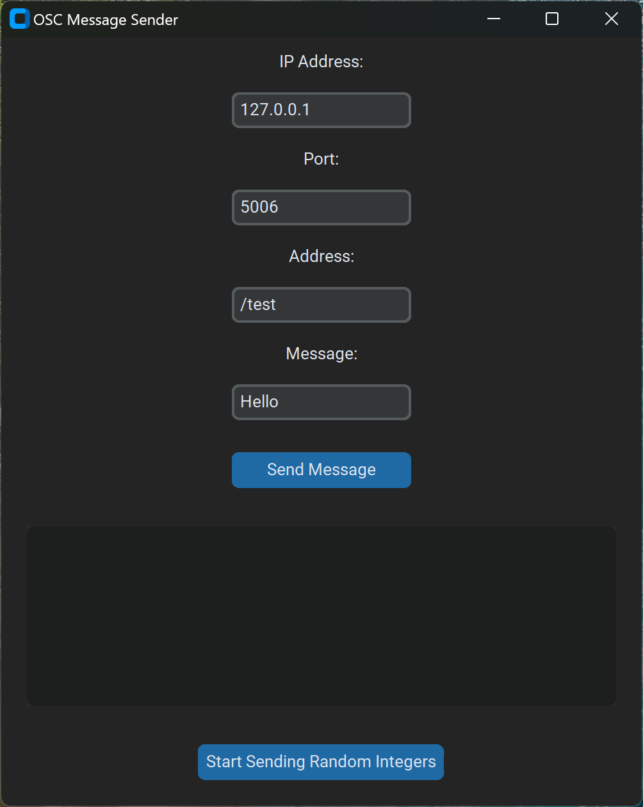
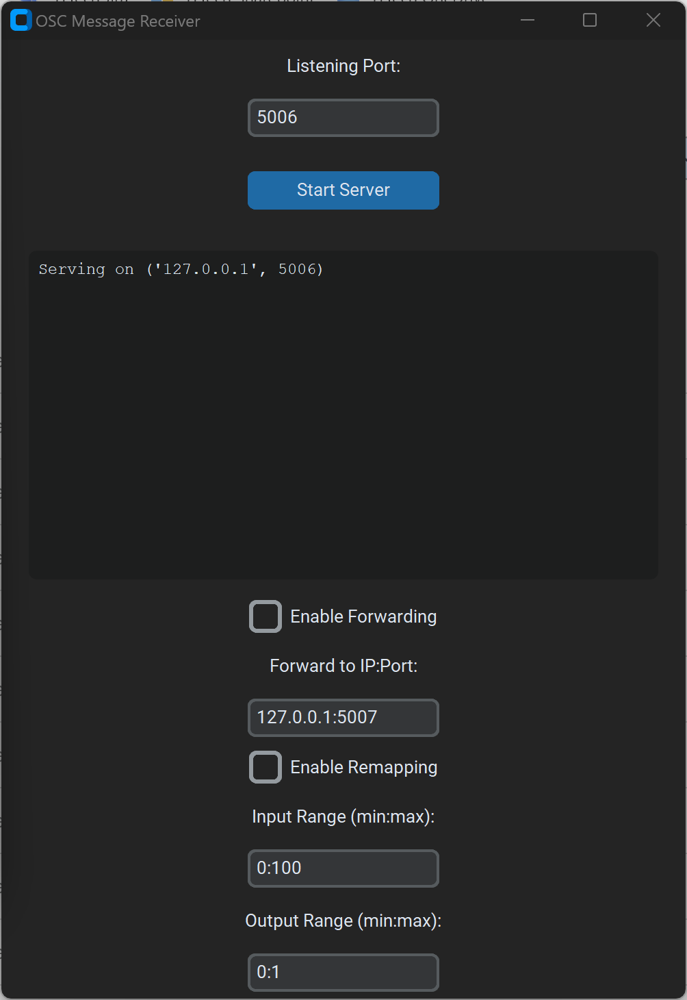

# Simple OSC Sender and Receiver
There are 2 programs here, 1 that can send OSC data (SimpleOSCSender) and the other that can receive (SimpleOSCReceiver). They both have simple GUI's that can be downloaded from the "releases" page.




## Building the Executable

To build executables, follow these steps:

1. Ensure you have `PyInstaller` installed:
   ```sh
   pip install pyinstaller

2. Run the following command to create the executable with the specified name and icon:

   ```sh
   pyinstaller --onefile --windowed --name=SimpleOSCReceiver --icon=receiver.ico receiver.py

   pyinstaller --onefile --windowed --name=SimpleOSCSender --icon=sender.ico sender.py
